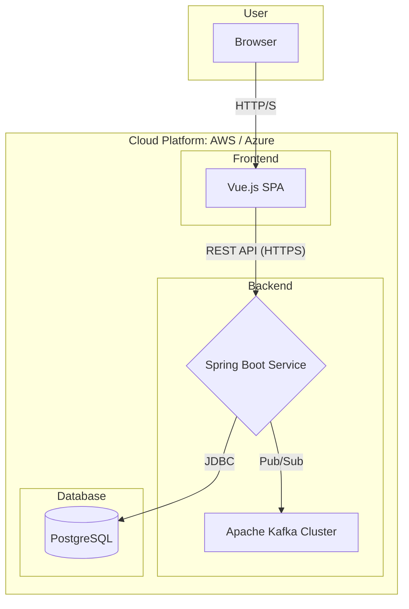
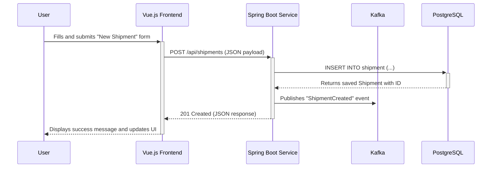
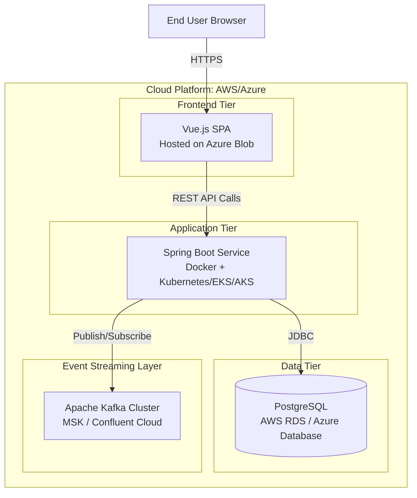

# Architecture Documentation: Supply Chain Cargo Management System  

**Date**: 2025-10-04  
**Author:** Dhairya Jangir  
**Version:** 1.0  

---
## 1. Executive Summary
This document outlines the architecture of the **Supply Chain Cargo Management System**, a three-tier web application designed for managing and tracking cargo shipments.  

The system is composed of:  
- **Vue.js SPA (Frontend)**  
- **Java Spring Boot Backend**  
- **PostgreSQL Database**  
- **Apache Kafka Cluster** (for real-time event streaming)  

The architecture is designed to be **scalable** and **maintainable**, with a clear separation of concerns between presentation, business logic, and data persistence.  

- The backend follows a standard layered architecture (**Controller → Service → Repository**) for development and testing.  
- Kafka enables **real-time updates**, **resilience**, and **decoupling** of services.  
- The system is intended for **cloud deployment** (AWS/Azure).  

---

## 2. How to Review This Doc
To verify the architecture, inspect the following repository files:  

- **High-Level Overview & Deployment**: `docs/project-roadmap-hld.md`  
- **Backend Layered Architecture**: `docs/backend-hld-details.md`  
- **Database Schema & Relationships**: `docs/er-diagram.png`, `server/basic-schema.sql`, `server/src/main/java/com/cargomanagement/models/`  
- **Frontend Structure**: `client/src/` (esp. `main.js`, `router/index.js`, `components/`)  
- **Backend Dependencies (Spring Boot, Kafka)**: `server/pom.xml`  

---

## 3. High-Level System Overview
The system is a **three-tier architecture** with an added **event-streaming layer**:  

- **Frontend Tier (Client):** Vue.js SPA for dashboards, cargo management, and tracking.  
- **Application Tier (Backend):** Spring Boot REST API containing all business logic.  
- **Data Tier:** PostgreSQL database for persistent storage.  
- **Asynchronous Event Layer:** Apache Kafka for shipment updates and real-time notifications.  

---

## 4. Component Diagram

---

## 5. Data Flow

### Synchronous Flow (Creating a Shipment)

1. User submits a new shipment form in Vue.js App.
2. App sends `POST /api/shipments` to Spring Boot Service.
3. Service validates, creates entity, saves to PostgreSQL.
4. Service responds to frontend with shipment data.

### Asynchronous Flow (Shipment Status Update)

1. GPS/IoT device updates shipment status via API call.
2. Spring Boot Service updates PostgreSQL.
3. Service publishes **ShipmentStatusUpdated** event to Kafka topic `shipment-events`.
4. Consumer service processes event and notifies Vue.js app in real time (e.g., WebSockets).

---

## 6. Sequence Diagram: New Shipment Creation

---

## 7. Component Responsibilities

| Component               | Responsibilities                                                                          | Code Location                                            |
| ----------------------- | ----------------------------------------------------------------------------------------- | -------------------------------------------------------- |
| **Vue.js Frontend**     | Render UI, manage client-side state, handle user interactions, call backend via REST API. | `client/`                                                |
| **Spring Boot Service** | Expose REST endpoints, business logic, persistence, Kafka integration.                    | `server/`                                                |
| Controller Layer        | Handle HTTP requests, validation, delegate to services.                                   | `server/src/main/java/com/cargomanagement/controllers/`  |
| Service Layer           | Core business logic, orchestration, Kafka pub/sub.                                        | `server/src/main/java/com/cymetrics/services/`           |
| Repository Layer        | Abstract data access with Spring Data JPA.                                                | `server/src/main/java/com/cargomanagement/repositories/` |
| **PostgreSQL DB**       | Persistent data store for shipments, cargo, vendors, routes.                              | `server/basic-schema.sql`                                |
| **Apache Kafka**        | Real-time message bus for events like shipment status changes.                            | `server/pom.xml`, infra configs                          |

---

## 8. Deployment Topology

The system is designed for **cloud-native deployment** on AWS or Azure.  

### Deployment Diagram

---

## 9. Interaction with External Systems

Planned integrations via Kafka:

* **GPS/IoT Devices** → Real-time location tracking.
* **Partner/Vendor Systems** → Automated booking and status updates.
* **Analytics Platforms** → Data pipelines for BI and reporting.

---

## 10. Scaling & Fault-Tolerance

* **Scalability:** Backend is stateless → horizontally scalable. Database can scale with replicas. Kafka scales by adding brokers.
* **Fault-Tolerance:** Multiple backend instances behind a load balancer, managed DB with HA, Kafka replication.

---

## 11. Important Trade-offs

* **Complexity vs. Scalability:** Kafka adds complexity but improves resilience and decoupling.
* **Consistency vs. Availability:** System favors availability. Notifications can be delayed if consumers are down, without breaking shipment creation.

****