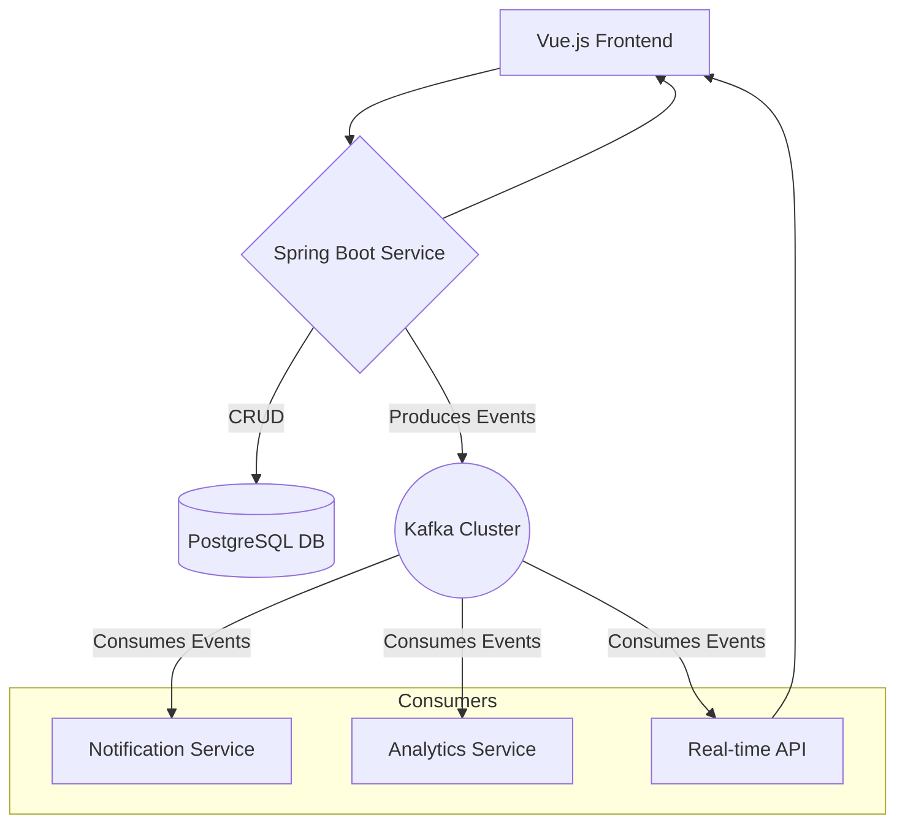

# Kafka Design & Usage Guide

**Date:** 2025-10-04 <br>
**Author:** Dhairya Jangir <br>
**Version:** 1.0 <br>

---

## 1. Why Kafka?

For the **Supply Chain Cargo Management System**, real-time updates are essential. Alternatives like RabbitMQ or WebSockets could work, but Kafka is the preferred choice because:

* **High Throughput & Scalability**
  Kafka can handle massive event volumes, making it suitable for tracking thousands of shipments with frequent updates from IoT devices.

* **Durability & Fault Tolerance**
  Events are persisted to disk and replicated across brokers. A “shipment delivered” event won’t vanish if a consumer service is down.

* **Service Decoupling**
  Kafka is the system’s **event backbone**. Producers (like shipment services) don’t need to know which downstream services will consume their events. This makes adding new services painless.

* **Stream Processing**
  Kafka Streams or ksqlDB allow for features like real-time anomaly detection (e.g., a shipment deviates from route) or live dashboards.

---

## 2. Kafka in Our Architecture

Kafka sits at the center as the **asynchronous event bus**.



* **Producer:** Spring Boot Service (`server/`). Publishes events after DB transactions (e.g., `shipment created`).
* **Consumers:** Initially inside the same service (e.g., push via WebSockets). Later, split into microservices (notifications, analytics, vendor assignments, etc.).
* **Topics:** Group related events, e.g., `shipment-events`.

---

## 3. Topic Design

| Topic Name           | Purpose                            | Partitions | Keying Strategy | Example Files (repo path)                            |
| -------------------- | ---------------------------------- | ---------- | --------------- | ---------------------------------------------------- |
| `shipment-events`    | Lifecycle events for shipments     | 6          | `shipmentId`    | `server/src/main/java/com/cargomanagement/services/` |
| `cargo-events`       | Cargo added/removed events         | 3          | `shipmentId`    | `server/src/main/java/com/cargomanagement/services/` |                                        |
| `vendor-assignments` | Vendor assignment lifecycle events | 2          | `vendorId`      | `server/src/main/java/com/cargomanagement/services/` |                                    |

* **Naming convention:** `[domain]-[event_type]s` (e.g., `shipment-events`)
* **Partitioning:** Start with moderate numbers (e.g., 6 for high-throughput topics).
* **Keying:** Ensure all events for a given entity go to the same partition → maintains ordering.

---

## 4. Message Schema Strategy

We will use **Avro** with a **Schema Registry**.

* **Why Avro?**

  * Schema evolution support (add/remove fields safely).
  * Compact binary format (faster than JSON).
  * Strong typing to prevent data issues.

* **Schema Registry:** Central store for schemas → producers and consumers dynamically resolve schema versions.

**Example Avro Schema (ShipmentStatusUpdated):**

```json
{
  "type": "record",
  "name": "ShipmentStatusUpdated",
  "namespace": "com.cargomanagement.events",
  "fields": [
    { "name": "shipmentId", "type": "string" },
    { "name": "oldStatus", "type": ["null", "string"], "default": null },
    { "name": "newStatus", "type": "string" },
    { "name": "timestamp", "type": "long", "logicalType": "timestamp-millis" }
  ]
}
```

---

## 5. Delivery Semantics

* **Default:** *At-least-once* delivery (sufficient for notifications, dashboards).
* **Requirement:** Consumers must be **idempotent** (safe if message delivered twice).
* **Future:** Use *exactly-once* semantics for financial or inventory-critical flows (requires Kafka transactions).

---

## 6. Environment Setup

### Local Dev (Docker Compose)

```yaml
# kafka-dev-setup.yml
version: '3'
services:
  zookeeper:
    image: confluentinc/cp-zookeeper:latest
    environment:
      ZOOKEEPER_CLIENT_PORT: 2181
  kafka:
    image: confluentinc/cp-kafka:latest
    depends_on:
      - zookeeper
    ports:
      - "9092:9092"
    environment:
      KAFKA_BROKER_ID: 1
      KAFKA_ZOOKEEPER_CONNECT: zookeeper:2181
      KAFKA_ADVERTISED_LISTENERS: PLAINTEXT://kafka:29092,PLAINTEXT_HOST://localhost:9092
      KAFKA_LISTENER_SECURITY_PROTOCOL_MAP: PLAINTEXT:PLAINTEXT,PLAINTEXT_HOST:PLAINTEXT
      KAFKA_INTER_BROKER_LISTENER_NAME: PLAINTEXT
      KAFKA_OFFSETS_TOPIC_REPLICATION_FACTOR: 1
```

### Production (Kubernetes/Helm)

* Deploy via **Bitnami Kafka Helm chart**.
* Handles StatefulSets, persistent volumes, service discovery, and rolling upgrades.

---

## 7. Observability

* **Metrics:** Prometheus + Grafana dashboards (topic lag, broker health, throughput).
* **Logging:** Structured logs in Spring Boot (JSON logs recommended).
* **Tracing:** OpenTelemetry to trace requests across API → Kafka → consumers.

---

## 8. Security

* **TLS:** Encrypt data in transit.
* **SASL:** Require client authentication.
* **ACLs:** Restrict producers/consumers by topic.

---

## 9. Sample Code Snippets

### Producer (Spring Boot)

```java
@Service
public class ShipmentService {

    @Autowired
    private KafkaTemplate<String, ShipmentStatusUpdated> kafkaTemplate;

    @Transactional
    public void updateShipmentStatus(String shipmentId, String newStatus) {
        // Save in PostgreSQL...
        ShipmentStatusUpdated event = new ShipmentStatusUpdated(
            shipmentId, "CREATED", newStatus, System.currentTimeMillis()
        );
        kafkaTemplate.send("shipment-events", shipmentId, event);
    }
}
```

### Consumer (Spring Boot)

```java
@Component
public class ShipmentEventConsumer {

    @KafkaListener(topics = "shipment-events", groupId = "dashboard-realtime-updater")
    public void handleShipmentUpdate(ShipmentStatusUpdated event) {
        // Push to frontend via WebSockets...
        System.out.println("Received shipment update for " + event.getShipmentId());
    }
}
```

---

## 10. Recommended Production Config

**Producer (`application.properties`)**

```properties
spring.kafka.producer.bootstrap-servers=kafka-broker1:9093,kafka-broker2:9093
spring.kafka.producer.key-serializer=org.apache.kafka.common.serialization.StringSerializer
spring.kafka.producer.value-serializer=io.confluent.kafka.serializers.KafkaAvroSerializer
spring.kafka.producer.properties.schema.registry.url=http://schema-registry:8081
spring.kafka.producer.acks=all
spring.kafka.producer.retries=3
```

**Consumer (`application.properties`)**

```properties
spring.kafka.consumer.bootstrap-servers=kafka-broker1:9093,kafka-broker2:9093
spring.kafka.consumer.group-id=cargo-management-group
spring.kafka.consumer.auto-offset-reset=earliest
spring.kafka.consumer.key-deserializer=org.apache.kafka.common.serialization.StringDeserializer
spring.kafka.consumer.value-deserializer=io.confluent.kafka.serializers.KafkaAvroDeserializer
spring.kafka.consumer.properties.schema.registry.url=http://schema-registry:8081
spring.kafka.consumer.properties.specific.avro.reader=true
```

---

## 11. References

* [Kafka Documentation](https://kafka.apache.org/documentation/)
* [Confluent Schema Registry](https://docs.confluent.io/platform/current/schema-registry/index.html)
* [Spring for Apache Kafka](https://spring.io/projects/spring-kafka)

****