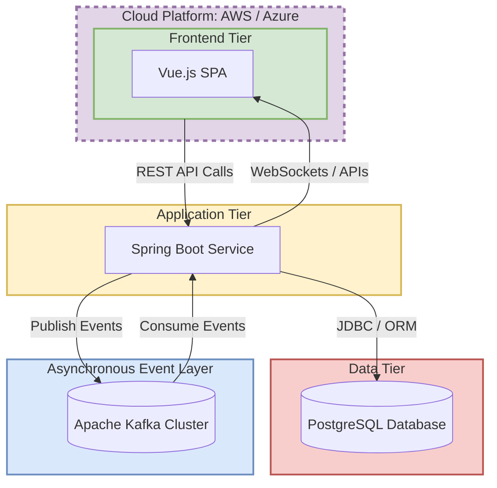

# Project: Supply Chain Cargo Management - Roadmap & HLD
**Date:** 2025-09-27  
**Author:** Dhairya Jangir
**Version:** 1.0  

## 1. Project Overview
This document outlines the project roadmap, high-level architecture, risk assessment, and core assumptions for the Supply Chain Cargo Management project. The goal is to build a system for managing cargo, tracking shipments, and coordinating with vendors, adhering to the Maersk Hackathon guidelines.

## 2. Team Members & Roles
- **Dinesh K.:** Backend & Database  
- **Rahul RR:** Frontend & UI  
- **Dhairya Jangir:** Architecture & Planning  

## 3. Technology Stack
- **Frontend:** Vue.js  
- **Backend:** Java Spring Boot  
- **Database:** PostgreSQL  
- **Event Streaming:** Apache Kafka  
- **Cloud Platform:** AWS / Azure  

## 4. Project Roadmap & Timeline
The project will be executed in three one-week sprints, with clear deliverables for each phase.

### Week 1 (Sep 27 - Oct 4): Foundational Setup & Design
**Objective:** To establish a complete and agreed-upon plan for the application's architecture, database structure, and user interface.  

**Key Deliverables:**
- Finalized Database Schema & Entity Relationship Diagrams (ERDs).  
- Comprehensive High-Level Design (HLD) and Low-Level Design (LLD) documents for all system components.  
- Complete UI wireframes for core user flows (Cargo, Shipment, Vendor).  
- Repository setup with a clear branching strategy and project management alignment.  

### Week 2 (Oct 6 - Oct 11): Core Functionality Implementation
**Objective:** To build and integrate the primary features of the application, resulting in a functional prototype.  

**Key Deliverables:**
- Implementation of all backend CRUD (Create, Read, Update, Delete) REST APIs for core entities.  
- Frontend development of components and views based on wireframes.  
- Successful integration between the Vue.js frontend and the Spring Boot backend APIs.  
- A basic, working version of the application deployed to the chosen cloud platform (AWS/Azure).  

### Week 3 (Oct 13 - Oct 18): Advanced Features & Finalization
**Objective:** To incorporate real-time capabilities, ensure system stability, and prepare for final submission.  

**Key Deliverables:**
- Integration of Apache Kafka for real-time event streaming (e.g., live shipment status updates).  
- A robust and final deployment of the application.  
- Thorough testing, bug fixing, and final code refinement.  
- Preparation of all required submission materials, including video demonstrations.  

## 5. High-Level Design (HLD)
The system is designed as a modern, scalable 3-tier architecture with an additional asynchronous event streaming layer to handle real-time data.  

**Component Breakdown:**

## 6. Initial Risk Assessment
**Technical Risk:** The integration of Kafka in Week 3 presents a moderate risk, as it introduces complexity.
**Mitigation:** Begin research and prototyping for Kafka integration early in Week 2.

**Integration Risk:** Misalignment on the API contract (request/response formats) between the frontend and backend is a high risk for rework.
**Mitigation:** Define and document the API specification (e.g., using OpenAPI/Swagger) during the LLD phase in Week 1.

**Timeline Risk:** The 3-week development schedule is aggressive.
**Mitigation:** Strictly adhere to the daily PR and check-in schedule to ensure consistent, incremental progress and early detection of blockers.

## 7. Core Assumptions
**Scalability:** The architecture is designed to be scalable to handle an initial target of 1000 concurrent shipments.

**Accountability:** Each team member is fully responsible for their assigned tasks and for meeting the daily submission requirements (PR, video, Projects App update).

**Tooling:** GitHub Copilot is approved for use as a development assistant. However, the developer who commits the code is ultimately responsible for its correctness, quality, and security.

****